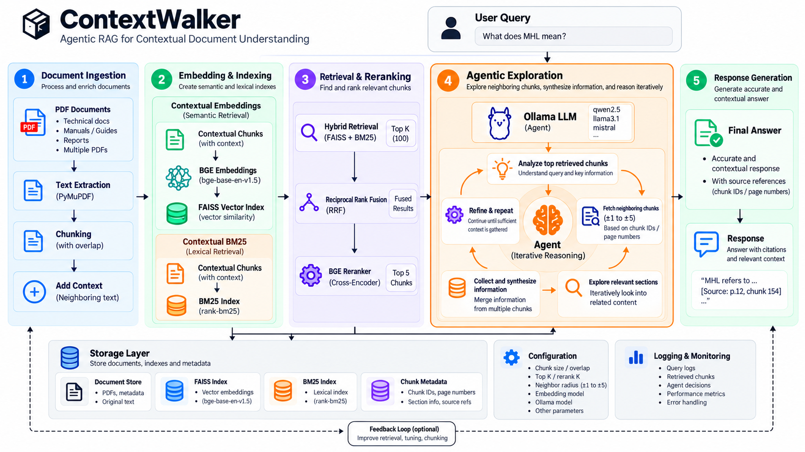

# Architecture



## Package layout

```text
src/contextwalker/
├── agent/       # Neighbor-chunk tool and Ollama exploration loop
├── document/    # PDF extraction, summary, chunking, context, and cache
├── retrieval/   # Embeddings, FAISS, BM25, fusion, and reranking
├── api.py        # Public ContextWalker class and ask_pdf helper
├── cli.py       # Interactive terminal interface
├── config.py    # Original constants and cache paths
├── pipeline.py  # System construction and query orchestration
└── schema.py    # Shared Chunk data model
```

## Indexing path

When no contextual-chunk cache exists, the system extracts page text from
`data.pdf`. Ollama creates a document description from samples of the first 15
pages. Pages are divided into overlapping chunks, and Ollama creates a short
retrieval-oriented context for every chunk using the document description and
adjacent text.

The contextual description and original chunk text are concatenated. That
combined text is used both for BGE embeddings stored in FAISS and for the BM25
corpus.

When the contextual-chunk cache exists, this preprocessing path is skipped and
the chunks are restored directly from JSON.

## Query path

Each query retrieves up to 60 results from FAISS and 60 from BM25. Reciprocal
Rank Fusion combines the two ranked lists, after which the best 100 candidates
are scored by the BGE cross-encoder. The five highest-scoring chunks become the
agent's starting evidence.

## Agent exploration

The Ollama chat model receives the top five chunks and one tool:
`fetch_neighbor_chunks`. The tool can return a radius of one to five chunks
around any valid chunk ID. Because returned chunks can become later centers,
the model can walk forward or backward through the document.

The loop allows at most 25 reasoning steps and 40 tool calls. When either limit
is reached, the model must answer using the accumulated evidence without more
tools.
